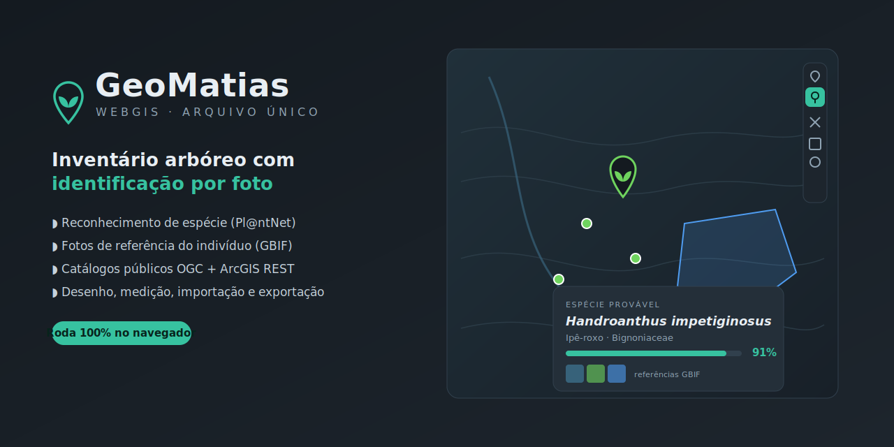

# GeoMatias — WebGIS

WebGIS de arquivo único (sem backend) para desenho, medição, importação/exportação de dados geoespaciais, busca em catálogos públicos (OGC WMS/WFS e ArcGIS REST) e **inventário arbóreo com identificação de espécie por foto**.

Abra o `index.html` no navegador — tudo roda no cliente.

## Publicar no GitHub Pages

1. Crie um repositório **público** e envie o `index.html` (e este `README.md`).
2. Vá em **Settings → Pages**.
3. Em **Source**, escolha **Deploy from a branch**; em **Branch**, selecione **main** e a pasta **/ (root)**. Salve.
4. Aguarde ~1–2 min. O endereço publicado aparece em Settings → Pages, no formato:
   `https://SEU-USUARIO.github.io/NOME-DO-REPO/`

Para atualizar depois, basta reenviar o `index.html` (Upload files → substituir → commit). O Pages republica sozinho.

## Ativar a identificação de árvores (Pl@ntNet)

A identificação por foto usa a API gratuita do Pl@ntNet e exige um domínio HTTPS autorizado — por isso funciona hospedada (ex.: GitHub Pages), e não via `file://`.

1. Crie conta em https://my.plantnet.org e copie a chave em **Settings → API key** (plano gratuito: 500 identificações/dia).
2. Ainda nas configurações, marque **"expose my API key"**.
3. Em **Authorized domains**, adicione o domínio publicado, com https:
   `https://SEU-USUARIO.github.io`
4. Abra a URL do GitHub Pages → ferramenta **Árvore** 🌳 → tire/anexe uma foto → botão **🔑** para colar a chave → **Identificar espécie**.

A chave fica salva **apenas no seu navegador** (localStorage), nunca no arquivo publicado.

## Como usar o inventário arbóreo

- Ferramenta **Árvore** cria pontos numa camada "Inventário arbóreo" pré-configurada.
- Anexe/fotografe o indivíduo (folha, flor, fruto ou casca — marque o órgão para melhor precisão).
- **Pl@ntNet** sugere as espécies mais prováveis com nível de confiança; ao escolher uma, preenche espécie, nome científico e família.
- **GBIF** mostra fotos de referência do táxon (com crédito e licença) para confirmação visual.
- Preencha DAP, altura, estado fitossanitário etc. e marque **"identificação confirmada por mim"**.
- A identificação é sempre uma **sugestão** — confirme antes de considerar definitiva.

No celular, o botão de foto abre a câmera diretamente. Dá para "adicionar à tela inicial" e usar como app em campo.

## Bases públicas incluídas no pesquisador

Federais/estaduais/municipais, via OGC (WMS/WFS) e adaptador ArcGIS REST:
IBGE, INDE, DNIT (via INDE), IDE-Sisema MG, GeoDourados-MS, IBAMA/Pamgia, IGC-SP, ANM/SIGMINE, SIMA-SP, DataGEO-SP, SICAR/CAR, SGB/CPRM e IDE-SP.

Disponibilidade varia por órgão (uptime/CORS). Bases em HTTP (ex.: IGC-SP na porta 6080) têm os *tiles raster* bloqueados por mixed-content quando a página está em HTTPS — limitação do navegador; a descoberta e o download de feições dessas bases ainda funcionam via proxy.

## Privacidade

Nenhum dado é enviado a servidores próprios: não há backend. Chave da API e projeto (camadas, rasters, fotos) vivem só no `localStorage` do navegador. Fotos anexadas podem conter metadados EXIF (inclusive GPS) — considere isso ao compartilhar exportações.
